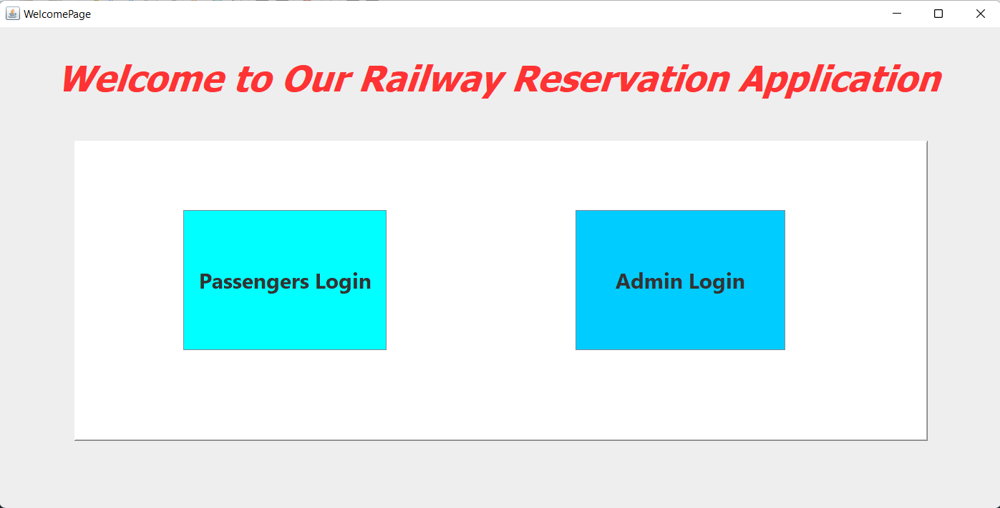
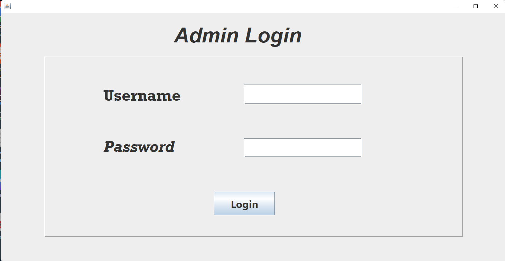
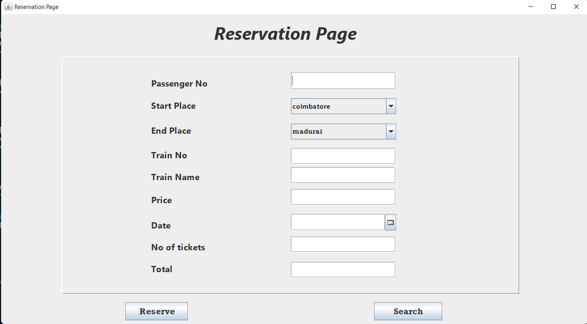
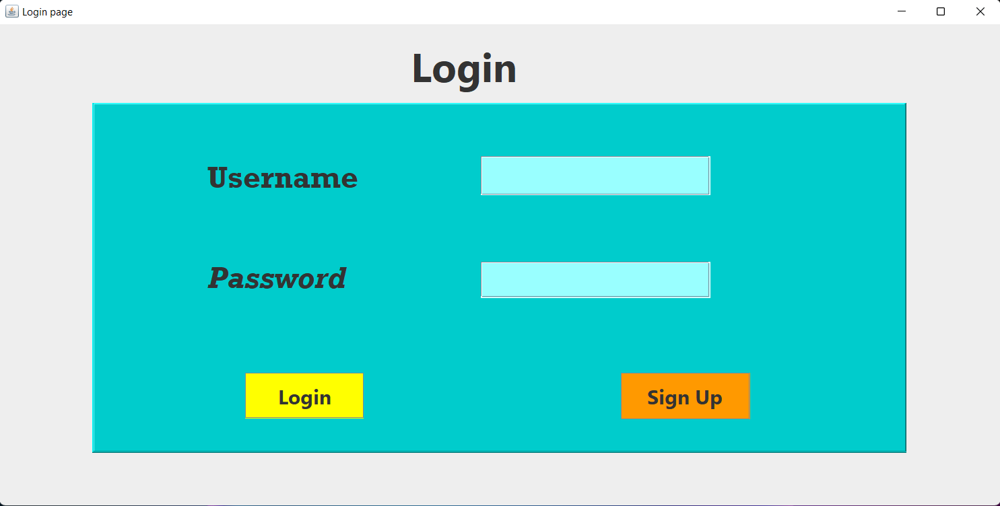
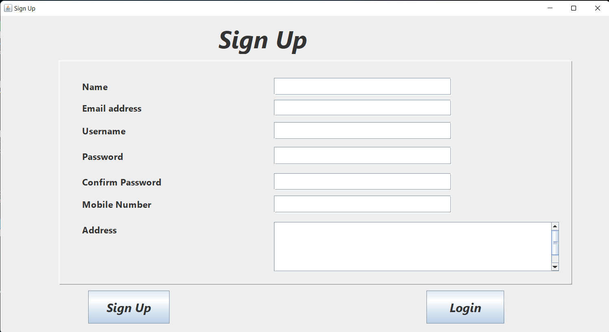
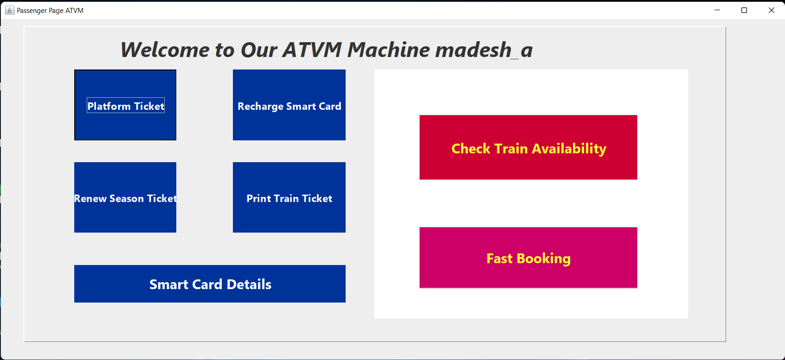
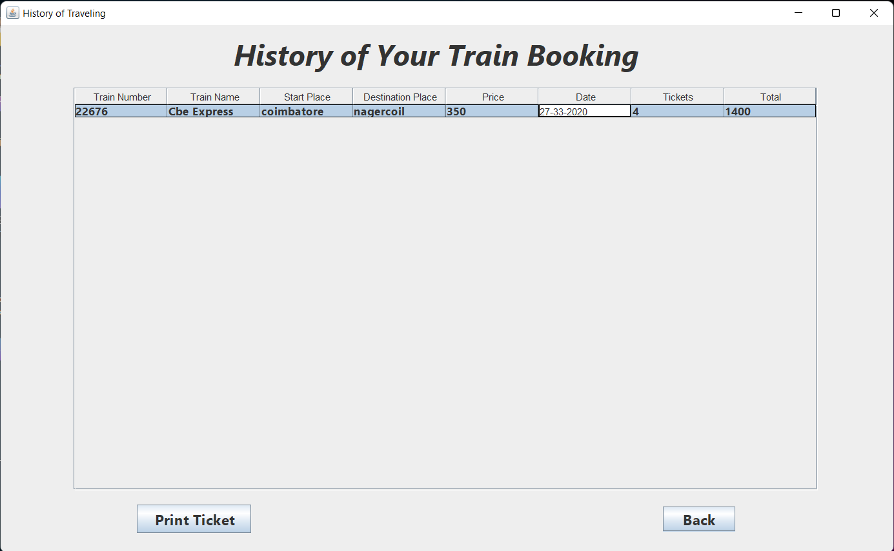
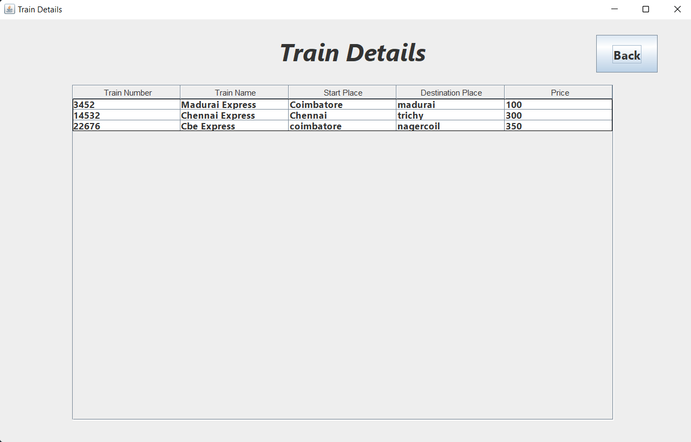
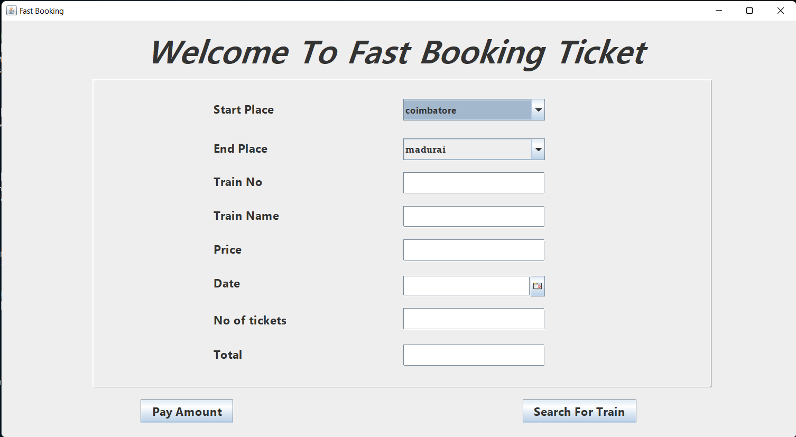

## 🚀 ATVM_Machine

`ATVM` stands for `A`utomatic `T`icket `V`ending `M`achine.
#### - We as a team created a software for ATVM in Railways inorder to help the passengers for faster ticket booking.
####   - Developed a interface like software which shares the information regarding current Trian avialiablity.
####  - Used Mysql(JDBC) to store train details and passengers details.

## Admin Page of the Software

## Passenger Page of Software

## 🤝 Team Members

👤 [**Mohamed Waseem A**](https://github.com/waseem0605)

👤 **Kavin Kumar S**

👤 [**Mohanraj M**](https://github.com/mohanraj-sece)

👤 **Madesh A**
